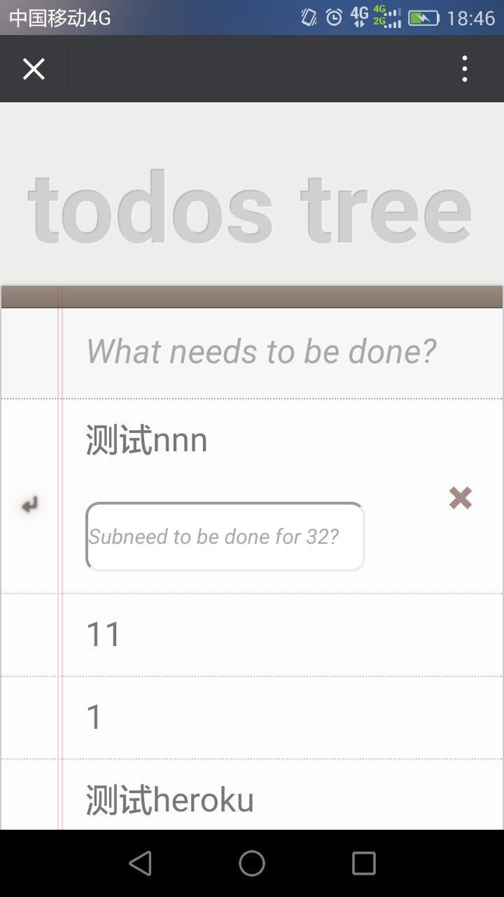

# 记录ClojureScript与React的学习经历, 包括reagent和om


- [记录ClojureScript与React的学习经历, 包括reagent和om](#%E8%AE%B0%E5%BD%95clojurescript%E4%B8%8Ereact%E7%9A%84%E5%AD%A6%E4%B9%A0%E7%BB%8F%E5%8E%86-%E5%8C%85%E6%8B%ACreagent%E5%92%8Com)
    - [1. r/atom](#1-ratom)
    - [2. r/render-component](#2-rrender-component)
    - [3. cljs.http](#3-cljshttp)
    - [4. a,button标签点击事件](#4-abutton%E6%A0%87%E7%AD%BE%E7%82%B9%E5%87%BB%E4%BA%8B%E4%BB%B6)
    - [5. label的双击修改事件on-double-click](#5-label%E7%9A%84%E5%8F%8C%E5%87%BB%E4%BF%AE%E6%94%B9%E4%BA%8B%E4%BB%B6on-double-click)
    - [6. input过程发生的三种常用的响应函数: input的键盘输入按下的事件on-key-down, 内容改变事件on-change, 点击input其他部分事件on-blur](#6-input%E8%BF%87%E7%A8%8B%E5%8F%91%E7%94%9F%E7%9A%84%E4%B8%89%E7%A7%8D%E5%B8%B8%E7%94%A8%E7%9A%84%E5%93%8D%E5%BA%94%E5%87%BD%E6%95%B0-input%E7%9A%84%E9%94%AE%E7%9B%98%E8%BE%93%E5%85%A5%E6%8C%89%E4%B8%8B%E7%9A%84%E4%BA%8B%E4%BB%B6on-key-down-%E5%86%85%E5%AE%B9%E6%94%B9%E5%8F%98%E4%BA%8B%E4%BB%B6on-change-%E7%82%B9%E5%87%BBinput%E5%85%B6%E4%BB%96%E9%83%A8%E5%88%86%E4%BA%8B%E4%BB%B6on-blur)
    - [7. js副作用的写法: http://himera.herokuapp.com/synonym.html](#7-js%E5%89%AF%E4%BD%9C%E7%94%A8%E7%9A%84%E5%86%99%E6%B3%95-httphimeraherokuappcomsynonymhtml)
    - [8. dom](#8-dom)
- [演示 heroku: rails api + clojurescript](#%E6%BC%94%E7%A4%BA-heroku-rails-api--clojurescript)


##### 1. r/atom 
只要修改atom内的任意一值,整个应用的任意一引用到atom的地方,都会底层自动修改掉
```clojure
(defonce counter (r/atom 0))
```
##### 2. r/render-component
渲染模块,可以对cljs纯函数单独测试,单独显示,cljs repl交互式开发
```clojure
(defn todo-app [] [:h1 "test..."])
(r/render-component [todo-app] (. js/document (getElementById "app"))) 
;; $('#app')
(dom/getElement "app") ;;=> #object[HTMLDivElement [object HTMLDivElement]]
(. js/document (getElementById "app")) ;;=> #object[HTMLDivElement [object HTMLDivElement]]

```
##### 3. cljs.http
通过lambda的回调caller传出 `(:body response)`, 然后通过swap!或者reset!将其值放入atom的原子或者列表里面
```clojure

(ns todos.core
  (:require-macros [cljs.core.async.macros :refer [go]])
  (:require [reagent.core :as r :refer [atom]]
            [cljs-http.client :as http]
            [cljs.core.async :refer [<!]]))

(defonce todos-list-init
  (go (let [response
            (<!
             (http/get "http://127.0.0.1:3001/todos"
                       {:with-credentials? false
                        :query-params {"since" ""}}))]
        (let [body (:body response)]
          (reset! todos (zipmap  (map :id body) body) )
          ))))

(defn create-todo [text body]
  (go (let [response
            (<!
             (http/post "http://127.0.0.1:3001/todos"
                        {:with-credentials? false
                         :query-params {:title text}}))]
        (body (:body response))
        )))
        
(defn add-todo [text]
  (do
    (create-todo
     text
     #(swap! todos assoc (:id %) {:id (:id %) :title (:title %) :done false}))
    )
  )
  
```

##### 4. a,button标签点击事件
lambda响应函数 `{:on-* (fn [x] ..)}` 放在离标签最近的Hash里面
```clojure
[:li [:a {:on-click #(js/alert "这里是a标签点击事件")} "Active"  ]]
[:button.reply {:on-click #(js/alert id)}]
```
##### 5. label的双击修改事件on-double-click
当鼠标双击input时,把input变成可输入修改的模式的class
```clojure
[:label {:on-double-click #(reset! editing true)} title]
```
##### 6. input过程发生的三种常用的响应函数: input的键盘输入按下的事件on-key-down, 内容改变事件on-change, 点击input其他部分事件on-blur
* 当鼠标点input的其他部位时,保存update提交: on-blur
* 当改变input内容时修改input的值value: on-change
* 按下键盘,如果是回车13就保存,如果是Esc27就停止修改
```clojure
      [:input {:type "text" :value @val
               :id id :class class :placeholder placeholder
               :on-blur save
               :on-change #(reset! val (-> % .-target .-value))
               :on-key-down #(case (.-which %)
                               13 (save)
                               27 (stop)
                               nil)}]
```

##### 7. js副作用的写法: http://himera.herokuapp.com/synonym.html

```clojure

(clojure.string/split window.location.search #"=|\?|\&") ;; 得到完整的参数params
(-> js/window .-location .-href) ;; 得到完整的链接
(.. js/window -location -href) ;; 得到完整的链接
(.. js/window -location -search) ;; 得到完整的参数params

;; 时间
(js/Date.) ;;=> #inst "2016-11-11T08:41:21.877-00:00"
;; js => ` new Date().getFullYear() `
(.toTimeString (js/Date.)) ;; => "00:36:01 GMT-0800 (PST)"
(js/Date.now) ;; => 1478853434489
(.getYear (js/Date.)) ;;=> 116
(.getFullYear (js/Date.)) ;; => 2016

(defn current-time []
  (let [date (js/Date.)]
    (str (.getFullYear date) "-" (.getMonth date) "-" (.getDate date))
    ) )
(current-time) ;;=> "2016-10-11"

```

方法调用

```clojure
(.method object params)

(.log js/console "hello world!")
```
访问属性

```clojure
(.-property object)

(.-style div)

```
设置属性

```clojure

(set! (.-property object))

(set! (.-color (.-style div) "#234567"))

(set! (.-innerHTML (. js/document (getElementById "app"))) "ABC")

```

##### 8. dom 
```clojure
;; => $('#dateTabShop li.active a')
(js/$ "#dateTabShop li.active a")
;; *.first
(aget (js/$ "#dateTabShop li.active a") 0) ;;=> #object[HTMLAnchorElement http://127.0.0.1:3000/#sh-tran-date]
;; *.first.title
(.-title (aget (js/$ "#dateTabShop li.active a") 0)) ;;=> "day"

```

##### 9. 滚动事件和高度计算

```clojurescript
(set! js/window.onscroll #(js/alert 111))


;; jimw_clj.core.cur_doc_top(): 底部是27737,头部是0
(defn cur-doc-top []
  (.. js/document -documentElement -scrollTop))

(.. js/document -documentElement -scrollHeight)

;; 
(defn is-page-end []
  (<=
   (- (.. js/document -documentElement -scrollHeight) ;; 整个页面的高度
      (.. js/document -documentElement -scrollTop)) ;; 窗口和页面两张纸, 会变的滚动高度
   (.. js/document -documentElement -offsetHeight)  ;; 控制台变小和变大会影响`窗口高度`
   ))
   
```


### [演示 heroku: rails api + clojurescript](http://todos-tree.herokuapp.com/todos-tree)


